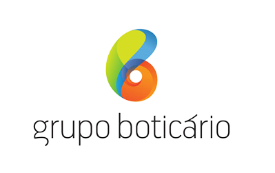

<h1 align="center">
    
</h1>

<h4 align="center">
	🚧 MicroBlog Boticário em construção... 🚧
</h4>

<h1 align="center">MicroBlog - Boticário</h1>

## Descrição do Projeto

                Desafio técnico proposto pelo time de recrutamento do <a href="https://www.grupoboticario.com.br/pt/Paginas/Inicial.aspx">Grupo Boticário</a>. Objetivo era construir um aplicativo interno com funções de um blog. A proposta foi a seguinte:  
                "Para que seus colaboradores possam compartilhar ideias e pensamentos do dia a dia, e também saber das últimas novidades do grupo, o Boticário irá lançar uma ferramenta de “microblogging”, onde seus colaboradores tenham acesso as novidades  e podem publicar posts de até 280 caracteres para que possam compartilhar atualizações pessoais e de projetos, ideias e curiosidades do Boticário.
Nessa ferramenta, o colaborador poderá ver as postagens de seus colegas na página inicial, em ordem cronológica, sempre mostrando a data e foto de todas as postagens. O colaborador também poderá visualizar as últimas novidades do Boticário.
Agora queremos criar mais uma solução, e é aí que você̂ entra com seu talento ;)
Vamos lá?
"

